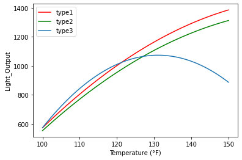

# Week3 Two-way ANOVA
## 背景描述
实验研究了操作温度和三种面板玻璃材料对示波器管输出光的影响。
这是一个压力（因子A）水平数 $a=3$，温度（因子B）水平数 $b=3$ 和重复次数 $n=3$ 的双因子实验。

## 数据描述
| 变量名 | 变量含义 | 变量类型 | 变量取值范围 |
| :----------: | :--------: | :----------: | :----------: |
| （自变量）Glass_Type | 玻璃材料类型 | categorical variable | [1，2，3] |
| （自变量）Temperature |   温度   | continuous variable | [100, 125, 150] |
| （因变量）Light_Output | 输出光 | continuous variable | Real |

## 问题 
注：这里使用 $\alpha$=0.05 的显著性水平

1. 试判断玻璃类型和温度对输出光是否有显著影响.
2. 用适合的残差图来检验设定模型的恰当性.
3. 选出一种玻璃类型，使得不论温度高低都能使示波器管的输出光较高.
4. 估计参数$\mu$、$\tau_i$、$\beta_j$和$(\tau\beta)_{ij}\quad(i=1,...,a;j=1,...,b)$
5. 如何对这种示波器管的输出光进行预测？

## 解决方案
**Q1:**  
检验行处理效应的等式假设:  $H_{01}:\tau_1=\tau_2=\cdots=\tau_a=0$  vs  $H_{11}:\tau_i \neq 0, \exists i$  
检验列处理效应的等式假设:  $H_{02}:\beta_1=\beta_2=\cdots=\beta_b=0$  vs  $H_{12}:\beta_j \neq 0, \exists j$  
检验行与列处理没有交互作用假设:  $H_{03}:(\tau\beta)_{ij}=0, \forall i,j$  vs  $H_{13}:(\tau\beta)_{ij} \neq 0, \exists i,j$  
利用python进行分析的具体分析结果如下：


```python
# Import standard packages
import numpy as np
import pandas as pd
import scipy.stats as stats
import matplotlib.pyplot as plt
import math

# Import additional packages
from statsmodels.formula.api import ols
from statsmodels.stats.anova import anova_lm
from statsmodels.stats.multicomp import (pairwise_tukeyhsd, MultiComparison)

alpha = 0.05
a = 3
b = 3
n = 3

x = pd.read_csv('Project3.csv')
data = x.values
df = pd.DataFrame(data, columns = ['Glass_Type', 'Temperature', 'Light_Output'])
print(df.head())

# Do the two-way ANOVA
model = ols('Light_Output~ C(Glass_Type) + C(Temperature) + C(Glass_Type):C(Temperature)',df).fit()
anova_results = anova_lm(model)
print('\n双因素方差分析表：\n', anova_results)

if anova_results['PR(>F)'][2] < alpha:
    print('\nFor Glass_Type:Temperature, p-value: %f < 0.05, reject H03.'% anova_results['PR(>F)'][2])
else:
    print('\nFor material:Temperature, accept H03.')

if anova_results['PR(>F)'][0] < alpha:
    print('\nFor Glass_Type, p-value: %f < 0.05, reject H01.'% anova_results['PR(>F)'][0])
else:
    print('\nFor Glass_Type, accept H01.')

if anova_results['PR(>F)'][1] < alpha:
    print('\nFor Temperature, p-value: %f < 0.05, reject H02.'% anova_results['PR(>F)'][1])
else:
    print('\nFor Temperature, accept H02.')
```

       Glass_Type  Temperature  Light_Output
    0           1          100           580
    1           1          100           568
    2           1          100           570
    3           2          100           550
    4           2          100           530
    
    双因素方差分析表：
                                     df        sum_sq        mean_sq            F  \
    C(Glass_Type)                  2.0  1.508645e+05   75432.259259   206.370554   
    C(Temperature)                 2.0  1.970335e+06  985167.259259  2695.259499   
    C(Glass_Type):C(Temperature)   4.0  2.905517e+05   72637.925926   198.725707   
    Residual                      18.0  6.579333e+03     365.518519          NaN   
    
                                        PR(>F)  
    C(Glass_Type)                 3.886026e-13  
    C(Temperature)                5.008957e-23  
    C(Glass_Type):C(Temperature)  1.254188e-14  
    Residual                               NaN  
    
    For Glass_Type:Temperature, p-value: 0.000000 < 0.05, reject H03.
    
    For Glass_Type, p-value: 0.000000 < 0.05, reject H01.
    
    For Temperature, p-value: 0.000000 < 0.05, reject H02.


由上面的方差分析表可知，在$\alpha=0.05$的水平下：  
对玻璃材料类型来说，$p=0.0000<0.05$，所以玻璃材料类型对输出光有显著影响；  
对温度来说，$p=0.0000<0.05$，所以温度对输出光也具有显著影响；  
对玻璃材料类型和温度的交互因素来说，$p=0.0000<0.05$，所以交互因素对输出光也具有显著影响.

【多重比较】在双因子析因设计实验中，如果交互作用是显著的，一个因子（例如，因子 A）的均值间的比较可能由于交互作用而模糊不清。解决这类问题的方法是：将另一个因子（因子 B）固定在一特定水平上，在此水平上对因子 A 的均值使用 Tukey 检验法。  
由上面方差分析表可知，行均值、列均值和交互项均有显著性差异，所以下面我们进一步固定温度水平为 70℉，对 3 种材料进行多重比较，以Tukey的Honestly Significant Difference(HSD)检验法为例: 


```python
# 使用Tukey HSD 检验法进行多重比较
multiComp = MultiComparison(df.loc[df['Temperature'] == 125, 'Light_Output'], df.loc[df['Temperature'] == 125, 'Glass_Type'])
tukey = multiComp.tukeyhsd()
print('固定温度水平为 125℉: 三种玻璃材料之间的多重比较: \n', tukey)

tukey.plot_simultaneous(ylabel= 'Glass_Type', xlabel= 'Score Difference')
print('\n')
```

    固定温度水平为 125℉: 三种玻璃材料之间的多重比较: 
      Multiple Comparison of Means - Tukey HSD, FWER=0.05  
    ======================================================
    group1 group2 meandiff p-adj    lower    upper  reject
    ------------------------------------------------------
         1      2 -52.3333 0.0523 -105.2908  0.6241  False
         1      3 -32.6667  0.221  -85.6241 20.2908  False
         2      3  19.6667 0.5285  -33.2908 72.6241  False
    ------------------------------------------------------


​    


    /Library/Frameworks/Python.framework/Versions/3.6/lib/python3.6/site-packages/statsmodels/sandbox/stats/multicomp.py:775: UserWarning: FixedFormatter should only be used together with FixedLocator
      ax1.set_yticklabels(np.insert(self.groupsunique.astype(str), 0, ''))


    


结果说明：  
这一分析表明，当温度水平为 125℉ 时，材料类型 1 与类型 3 ，材料类型 2 与类型 3 的输出光差异不显著，但材料类型 1 与类型 2 的输出光具有显著差异。

**Q2:**  
检验设定模型的恰当性：  
**残差分析0: 计算电池寿命数据的残差**


```python
# 计算电池寿命数据的残差
list_temp = [100, 125, 150]
data_res = data.astype(float)
for i in range(a):
    for j in list_temp:
        cnt = data[(data[:,0] == i + 1) & (data[:,1] == j),2]
        data_res[(data_res[:,0] == i + 1) & (data_res[:,1] == j),2] = cnt-np.mean(cnt)
df = pd.DataFrame(data_res, columns = ['Glass_Type', 'Temperature', 'Light_Output'])
print(df)
```

        Glass_Type  Temperature  Light_Output
    0          1.0        100.0      7.333333
    1          1.0        100.0     -4.666667
    2          1.0        100.0     -2.666667
    3          2.0        100.0     -3.000000
    4          2.0        100.0    -23.000000
    5          2.0        100.0     26.000000
    6          3.0        100.0    -27.333333
    7          3.0        100.0      1.666667
    8          3.0        100.0     25.666667
    9          1.0        125.0      2.666667
    10         1.0        125.0     -0.333333
    11         1.0        125.0     -2.333333
    12         2.0        125.0     35.000000
    13         2.0        125.0      0.000000
    14         2.0        125.0    -35.000000
    15         3.0        125.0     -9.666667
    16         3.0        125.0     -1.666667
    17         3.0        125.0     11.333333
    18         1.0        150.0      6.000000
    19         1.0        150.0     -6.000000
    20         1.0        150.0      0.000000
    21         2.0        150.0     15.000000
    22         2.0        150.0     -1.000000
    23         2.0        150.0    -14.000000
    24         3.0        150.0    -19.666667
    25         3.0        150.0     17.333333
    26         3.0        150.0      2.333333


**残差分析1: 残差的正态概率图** 


```python
# 残差的正态概率图
res = data_res[:, 2]
osm, osr = stats.probplot(res, dist = 'norm', plot = plt)
x = osm[0][0]
y = osm[1][0]
plt.text(x, y, '%.2f' % float(y), ha='center', va= 'bottom', fontsize=9)
plt.grid()
plt.show()
```


​    

​    


无特别的证据说明违背数据正态性；
异常值的检测：
$\frac{-35.000}{\sqrt{365.518}}=-1.83>-2$
不存在绝对值大于 2 的残差，判断不存在异常值。  

(计算标准化残差：$d_{ij} = \frac{e_{ij}}{\sqrt{MS_E}}$。一般地，标准化残差约 68% 落在 ±1 之内，约 95% 落在 ±2 之内，几乎全部落在 ±3 之内。标准化残差的绝对值大于3的残差是一个可能的异常值。)


```python
# 用Shapiro-Wilk检验进行正态性检验
SW, pVal = stats.shapiro(res)
print(round(SW, 2))
print(round(pVal, 2))

if pVal > alpha:
    print('\nAccept the null hypothesis.')
else:
    print('\nSince p-value > 0.05, reject the null hypothesis') 
```

    0.97
    0.52
    
    Accept the null hypothesis.


以上结果说明接受原假设，即残差具有正态性。

**残差分析2: 残差与预测值的关系图**  


```python
# 残差与预测值的关系图
y2 = []
for i in range(a):
    for j in list_temp:
        for k in range(n):
            y2.append(np.mean(data[(data[:,0] == i + 1) & (data[:,1] == j), 2]))
plt.scatter(y2, res, c = 'red')
plt.text(y2[12], res[12], '%.2f' % float(res[12]), ha='center', va= 'bottom', fontsize=9)
plt.text(y2[12], res[14], '%.2f' % float(res[14]), ha='center', va= 'bottom', fontsize=9)
plt.title('Plot of residuals versus y_ijk')
plt.xlabel('y_ijk')
plt.ylabel('e_ijk')
```


    Text(0, 0.5, 'e_ijk')


​    

​    


由上图可以看出，当输出光很小时，残差方差同样较小。但当输出光增大时，残差方差不一定随之同样增大，而是在略大于1000的位置达到最大值。

**残差分析3：残差与材料的关系图**  


```python
# 残差对材料种类的关系图
y3 = data_res[:,0]
plt.scatter(y3, res, c = 'red')
plt.title('Plot of residuals versus glass type')
plt.xlabel('Glass type')
plt.ylabel('e_ijk')
```


    Text(0, 0.5, 'e_ijk')


​    

​    


上图显示出方差较为明显的不等性：玻璃材料为第一种时，方差远小于另外两种。另外玻璃材料二的方差略大于玻璃材料三的方差。

**残差分析4：残差与温度的关系图**  


```python
# 残差对温度的关系图
y4 = data_res[:,1]
plt.scatter(y4, res, c = 'red')
plt.title('Plot of residuals versus temperature')
plt.xlabel('Temperature (°F)')
plt.ylabel('e_ijk')
```


    Text(0, 0.5, 'e_ijk')


​    

​    


上图显示出方差微弱的不等性：温度为 125℉ 时，比其他情况下方差大。

在 125℉ 的温度-玻璃材料类型2 这一单元中，包含了两个极端残差值（-35.00 与 35.00）。这两个残差值对于后面三张图检验出的方差不等起了主要作用。在实际生产的过程中，需要重新审查这些数据，如并未显出任何明显的问题，比如记录错误等，则应把所有响应作为真实数据接收下来。本题目中认为所有数据均为真实数据。

**Q3:**  
为了选出一种材料，使得不论温度高低与否都能使电池有较长的寿命，我们进行固定效应模型分析。


```python
# 固定效应模型分析
data_avg = data.astype(float) * 1
for i in range(a):
    for j in list_temp:
        cnt = data[(data[:,0] == i + 1) & (data[:,1] == j),2]
        data_avg[(data_avg[:,0] == i + 1) & (data_avg[:,1] == j),2] = np.mean(cnt)
df = pd.DataFrame(data_avg, columns = ['Glass_Type', 'Temperature', 'Light_Output'])
print(df.head())

type1 = data_avg[[0,9,18], 2]
type2 = data_avg[[3,12,21], 2]
type3 = data_avg[[6,15,24], 2]
c1 = pd.Series(type1, index = list_temp, name = 'type1')
c2 = pd.Series(type2, index = list_temp, name = 'type2')
c3 = pd.Series(type3, index = list_temp, name = 'type3')
df = pd.concat([c1, c2, c3], axis = 1)

plt.plot(df.iloc[:,0], color = 'red', marker = 'o', label = 'type1')
plt.plot(df.iloc[:,1], color = 'green', marker = 'o', label = 'type2')
plt.plot(df.iloc[:,2], marker = 'o', label = 'type3')
plt.title('glass type–temperature plot')
plt.xlabel('Temperature (°F)')
plt.ylabel('Average Light_Output')
plt.legend(['type1', 'type2', 'type3'])
```

       Glass_Type  Temperature  Light_Output
    0         1.0        100.0    572.666667
    1         1.0        100.0    572.666667
    2         1.0        100.0    572.666667
    3         2.0        100.0    553.000000
    4         2.0        100.0    553.000000


    <matplotlib.legend.Legend at 0x7f8861f05898>


​    

​    


上图绘制了每一种处理组合的平均响应图，因为线段2和3不平行，所以交互作用显著。一般来说，不管是什么玻璃材料，在低温处的输出光都较低。随着温度升高，材料1和2的输出光随之增加。但当温度增加到150度时，输出光反而下降。总体上来看材料1的输出光无论在所有的温度下的输出光都是最高的。因此如果我们希望使输出光尽量高，玻璃材料类型 1 给出了最好的结果。 

**Q4:**  
估计参数$\mu$、$\tau_i$、$\beta_j$和$(\tau\beta)_{ij}\quad(i=1,...,a;j=1,...,b)$  
$\hat{\mu}=\bar{y}_{\cdots}$  
$\hat{\tau_i}=\bar{y}_{i\cdot\cdot}-\bar{y}_{\cdots},\quad i = 1,2,\cdots,a$  
$\hat{\beta_j}=\bar{y}_{\cdot j\cdot}-\bar{y}_{\cdots},\quad j = 1,2,\cdots,b$  
$\hat{\tau\beta}_{ij}=\bar{y}_{ij\cdot}-\bar{y}_{i\cdot\cdot}-\bar{y}_{\cdot j\cdot}+\bar{y}_{\cdots},\quad i = 1,2,\cdots,a\quad j = 1,2,\cdots,b$


```python
# 参数估计
mu = np.mean(data[:,2])
print('总平均效应：', round(mu, 2))

tau = []
for i in range(a):
    tau.append(np.mean(data[data[:,0] == i + 1, 2]) - mu)
print('材料因子的水平效应：\n', np.round(tau, 2))

beta = []
for j in list_temp:
    beta.append(np.mean(data[data[:,1] == j, 2]) - mu)
print('温度因子的水平效应：\n', np.round(beta, 2))

tau_beta = []
k = 0
for i in range(a):
    tau_beta.append([])
    for j in range(b):
        cnt = data_avg[0 + 3 * k, 2] - tau[i] - beta[j] + mu
        tau_beta[i].append(cnt)
    k += 3
print('两因子之间的交互作用效应：\n', np.round(tau_beta, 2))
```

    总平均效应： 940.19
    材料因子的水平效应：
     [  75.15   26.81 -101.96]
    温度因子的水平效应：
     [-373.85  118.81  255.04]
    两因子之间的交互作用效应：
     [[1811.56 1318.89 1182.67]
     [2374.56 1881.89 1745.67]
     [2802.   2309.33 2173.11]]


**Q5:**  
由于温度是定量的，而材料类型是定性的。再者，温度有 3 个水平。因此，我们可计算线性的和二次的温度效应，以便研究温度怎样影响电池寿命。  
这里我们画出响应曲线（response curve）可以得到响应变量与定量因子——温度的关系。一般地，线性回归方法可用于为实验数据拟合相应的模型。  
$Life = \beta_0+\beta_1A+\beta_2B_1+\beta_3B_2+\beta_4A^2+\beta_5AB_1+\beta_6AB_2+\beta_7A^2B_1+\beta_8A^2B_2$  
其中，分量 $A, A^2$ 分别表示温度因子的一次效应、二次效应，$B$ 表示材料类型因子的主效应。由于温度为低、中、高水平(15℉， 70℉ ， 125℉ )，对应的温度水平分别为 $A=-1，0，+1$。变量 $B[1]$ 和 $B[2]$ 被认为是示性变量（indicator variable），其定义为:  

|  | 1 | 2 | 3 |
| :--------: | :--------: | :--------: | :---------: |
| $B[1]$ |   1   |   0   |   -1   |
| $B[2]$ |   0   |   1   |   -1   |


```python
# 构造这 8 个变量
list_A = [100, 125, 150]
#list_A = [-1, 0, 1]
list_B1 = [1, 0, -1]
list_B2 = [0, 1, -1]
A = data[:,1] * 1
B1 = B2 = data[:, 0]
for i in range(3):
    A = [list_A[i] if j == list_temp[i] else j for j in A]
    B1 = [list_B1[i] if j == i + 1 else j for j in B1]
    B2 = [list_B2[i] if j == i + 1 else j for j in B2]
AA = [A[k] ** 2 for k in range(len(A))]
AB1 = [A[k] * B1[k] for k in range(len(A))]
AB2 = [A[k] * B2[k] for k in range(len(A))]
AAB1 = [AA[k] * B1[k] for k in range(len(A))]
AAB2 = [AA[k] * B2[k] for k in range(len(A))]
df = pd.DataFrame(A, columns = ['A'])
df['B1'] = B1
df['B2'] = B2
df['AA'] = AA
df['AB1'] = AB1
df['AB2'] = AB2
df['AAB1'] = AAB1
df['AAB2'] = AAB2
df['Life'] = data[:,2]
print(df.head())

# 训练模型
model = ols('Life~ A + B1 + B2 + AA + AB1 + AB2 + AAB1 + AAB2',df).fit()
param = model.params
model.summary()
```

         A  B1  B2     AA  AB1  AB2   AAB1   AAB2  Life
    0  100   1   0  10000  100    0  10000      0   580
    1  100   1   0  10000  100    0  10000      0   568
    2  100   1   0  10000  100    0  10000      0   570
    3  100   0   1  10000    0  100      0  10000   550
    4  100   0   1  10000    0  100      0  10000   530


<table class="simpletable">
<caption>OLS Regression Results</caption>
<tr>
  <th>Dep. Variable:</th>          <td>Life</td>       <th>  R-squared:         </th> <td>   0.997</td>
</tr>
<tr>
  <th>Model:</th>                   <td>OLS</td>       <th>  Adj. R-squared:    </th> <td>   0.996</td>
</tr>
<tr>
  <th>Method:</th>             <td>Least Squares</td>  <th>  F-statistic:       </th> <td>   824.8</td>
</tr>
<tr>
  <th>Date:</th>             <td>Fri, 19 Mar 2021</td> <th>  Prob (F-statistic):</th> <td>1.78e-21</td>
</tr>
<tr>
  <th>Time:</th>                 <td>21:21:01</td>     <th>  Log-Likelihood:    </th> <td> -112.51</td>
</tr>
<tr>
  <th>No. Observations:</th>      <td>    27</td>      <th>  AIC:               </th> <td>   243.0</td>
</tr>
<tr>
  <th>Df Residuals:</th>          <td>    18</td>      <th>  BIC:               </th> <td>   254.7</td>
</tr>
<tr>
  <th>Df Model:</th>              <td>     8</td>      <th>                     </th>     <td> </td>   
</tr>
<tr>
  <th>Covariance Type:</th>      <td>nonrobust</td>    <th>                     </th>     <td> </td>   
</tr>
</table>
<table class="simpletable">
<tr>
      <td></td>         <th>coef</th>     <th>std err</th>      <th>t</th>      <th>P>|t|</th>  <th>[0.025</th>    <th>0.975]</th>  
</tr>
<tr>
  <th>Intercept</th> <td>-4968.7778</td> <td>  191.292</td> <td>  -25.975</td> <td> 0.000</td> <td>-5370.666</td> <td>-4566.889</td>
</tr>
<tr>
  <th>A</th>         <td>   83.8667</td> <td>    3.127</td> <td>   26.818</td> <td> 0.000</td> <td>   77.297</td> <td>   90.437</td>
</tr>
<tr>
  <th>B1</th>        <td> 1322.7778</td> <td>  270.527</td> <td>    4.890</td> <td> 0.000</td> <td>  754.421</td> <td> 1891.134</td>
</tr>
<tr>
  <th>B2</th>        <td> 1553.7778</td> <td>  270.527</td> <td>    5.744</td> <td> 0.000</td> <td>  985.421</td> <td> 2122.134</td>
</tr>
<tr>
  <th>AA</th>        <td>   -0.2852</td> <td>    0.012</td> <td>  -22.834</td> <td> 0.000</td> <td>   -0.311</td> <td>   -0.259</td>
</tr>
<tr>
  <th>AB1</th>       <td>  -24.4000</td> <td>    4.423</td> <td>   -5.517</td> <td> 0.000</td> <td>  -33.692</td> <td>  -15.108</td>
</tr>
<tr>
  <th>AB2</th>       <td>  -27.8667</td> <td>    4.423</td> <td>   -6.301</td> <td> 0.000</td> <td>  -37.158</td> <td>  -18.575</td>
</tr>
<tr>
  <th>AAB1</th>      <td>    0.1124</td> <td>    0.018</td> <td>    6.362</td> <td> 0.000</td> <td>    0.075</td> <td>    0.149</td>
</tr>
<tr>
  <th>AAB2</th>      <td>    0.1220</td> <td>    0.018</td> <td>    6.905</td> <td> 0.000</td> <td>    0.085</td> <td>    0.159</td>
</tr>
</table>
<table class="simpletable">
<tr>
  <th>Omnibus:</th>       <td> 0.570</td> <th>  Durbin-Watson:     </th> <td>   2.273</td>
</tr>
<tr>
  <th>Prob(Omnibus):</th> <td> 0.752</td> <th>  Jarque-Bera (JB):  </th> <td>   0.035</td>
</tr>
<tr>
  <th>Skew:</th>          <td> 0.009</td> <th>  Prob(JB):          </th> <td>   0.983</td>
</tr>
<tr>
  <th>Kurtosis:</th>      <td> 3.175</td> <th>  Cond. No.          </th> <td>1.52e+06</td>
</tr>
</table><br/><br/>Notes:<br/>[1] Standard Errors assume that the covariance matrix of the errors is correctly specified.<br/>[2] The condition number is large, 1.52e+06. This might indicate that there are<br/>strong multicollinearity or other numerical problems.


拟合曲线[-1, 1]： 

$Life = 1059+314.44 *A+28.33 *B[1]-24 *B[2]-178.22 *A^2+92.22 *AB[1]+65.56 *AB[2]+70.22 *A^2B[1]+76.22 *A^2B[2]$

拟合曲线[100, 150]： 

$Life = -4968.78+83.87 *A+1322.78 *B[1]+1553.78 *B[2]-0.29 *A^2-24.4 *AB[1]-27.87 *AB[2]+0.11 *A^2B[1]+0.12 *A^2B[2]$


```python
# 拟合响应曲线
temp = np.linspace(100,150)
#temp = np.linspace(-1, 1)
life_type1 = param[0] + param[1] * temp + param[2] * list_B1[0] + param[3] * list_B2[0] + param[4] * (temp ** 2) + param[5] * temp * list_B1[0] + param[6] * temp * list_B2[0] + param[7] * (temp ** 2) * list_B1[0] + param[8] * (temp ** 2) * list_B2[0]
life_type2 = param[0] + param[1] * temp + param[2] * list_B1[1] + param[3] * list_B2[1] + param[4] * (temp ** 2) + param[5] * temp * list_B1[1] + param[6] * temp * list_B2[1] + param[7] * (temp ** 2) * list_B1[1] + param[8] * (temp ** 2) * list_B2[1]
life_type3 = param[0] + param[1] * temp + param[2] * list_B1[2] + param[3] * list_B2[2] + param[4] * (temp ** 2) + param[5] * temp * list_B1[2] + param[6] * temp * list_B2[2] + param[7] * (temp ** 2) * list_B1[2] + param[8] * (temp ** 2) * list_B2[2]

c1 = pd.Series(life_type1, index = temp, name = 'type1')
c2 = pd.Series(life_type2, index = temp, name = 'type2')
c3 = pd.Series(life_type3, index = temp, name = 'type3')
df = pd.concat([c1, c2, c3], axis = 1)

plt.plot(df.iloc[:,0], color = 'red', label = 'type1')
plt.plot(df.iloc[:,1], color = 'green', label = 'type2')
plt.plot(df.iloc[:,2], label = 'type3')
plt.xlabel('Temperature (°F)')
plt.ylabel('Light_Output')
plt.legend(['type1', 'type2', 'type3'])
```


    <matplotlib.legend.Legend at 0x7f8861f6f940>


​    

​    


拟合曲线[-1, 1]：
材料类型为 1：
$y = 1087.33 + 406.66 ∗ Temp - 108 ∗ Temp^2 $
材料类型为 2：
$y = 1035 + 380 ∗ Temp − 102.22 ∗ Temp^2 $
材料类型为 3：
$y = 1054.67 + 156.66 ∗ Temp − 324.66 ∗ Temp^2 $

拟合曲线[100, 150]：
材料类型为 1：
$y = -3646 + 59.47 ∗ Temp - 0.18 ∗ Temp^2 $
材料类型为 2：
$y = -3415 + 56 ∗ Temp − 0.17 ∗ Temp^2 $
材料类型为 3：
$y = -7845.34 + 136.14 ∗ Temp − 0.52 ∗ Temp^2 $
上图显示了这 3 个预测公式生成的响应曲线。 